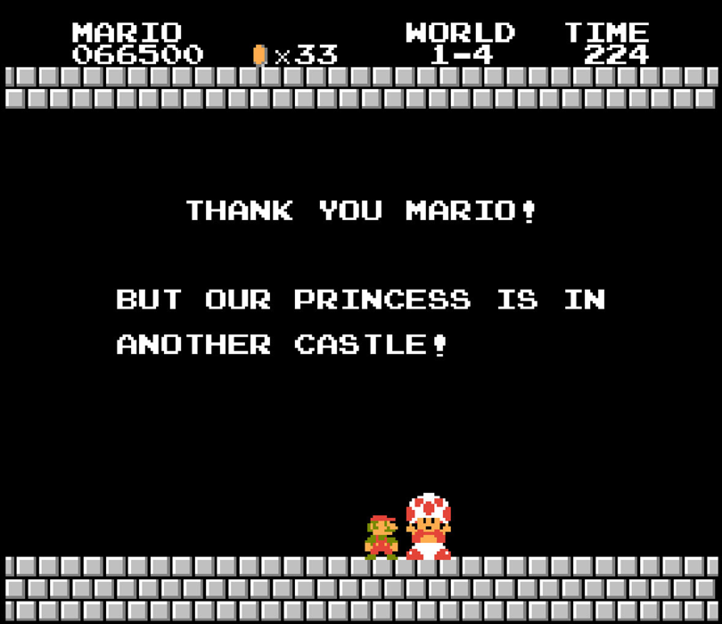

---
layout: clean
title: "Page Not Found"
description: "Page not found. Your pixels are in another canvas."
---  

    </a>

Sorry, but the page you are looking for could not be found. Try checking the URL for errors, then refresh the page.

    <a markdown="0" href="http://renzolucioni.com" class="btn">Home Page</a>

